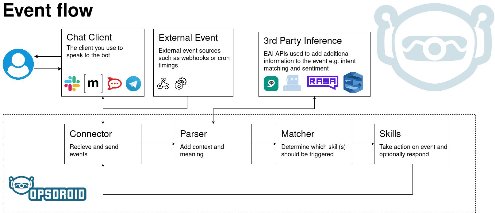

# Overview

## ChatOps

_"ChatOps is an operational paradigm where work that is already happening in the background today is brought into a common chatroom. By doing this, you are unifying the communication about what work should get done with actual history of the work being done."_ - [StackStorm](https://docs.stackstorm.com/chatops/chatops.html)

In this new frontier of DevOps, it is becoming more and more popular to interact with your automation tools via an instant messenger. Opsdroid is a framework to make creating and extending your ChatOps workflows powerful but simple.

## Event Flow

Opsdroid is an event-driven framework powered by [asyncio](#asyncio). The event flow is broken down into four main steps which use different modules within opsdroid:

- Events start and end their lives in **Connectors** which connect to external services. The most common example of a connector would be a chat connector which interfaces with the chat service of your choosing and triggers events whenever people send messages to your bot. There are also other connectors which can be triggered on non-chat events such as cron timings for scheduled events or webhooks. For more information see the [connectors documentation](connectors/index.md).
- Next events are parsed by **Parser** modules which take an event and run it through various services to add more information and context to the event. This could be as simple as testing a chat message against various regular expressions to see if any match, to running text or images through third-party AI inferencing services to perform [Natural Language Understanding](https://en.wikipedia.org/wiki/Natural-language_understanding) or [object recognition tasks](https://en.wikipedia.org/wiki/Machine_vision).
- **Matching** is next where opsdroid compares the event with all of the skills which have been configured. The most suitable skill (if any) is run to handle the event based on various criteria. For more information see the [matchers documentation](skills/matchers/index.md).
- **Skills** are then run to process the event in whatever way you like. You define these as Python functions which take an event object and run any arbitrary code you like. This may be to respond to a chat message with another chat message or to take some more advanced course of action such as deploying an application, restarting a server or anything you can do in Python. You can learn more about writing skills in [this section of the documentation](skills/index.md).




## Modules

To handle functionality and allow maximum flexibility opsdroid is broken up into various modules. Some of these modules are shipped with opsdroid by default but all have pluggable interfaces so users can write their own.

- **Connectors** are modules for connecting opsdroid to your specific chat service or event source.
- **Skills** are modules that define what actions opsdroid should perform based on different chat messages.
- **Databases** are modules that connect opsdroid to your chosen database and allow skills to store information between messages.

Also, opsdroid has core functionality for managing modules and events. While these are not pluggable with third-party modules we strongly encourage [contribution](contributing/index.md) to the opsdroid codebase.

- **Parsers** add additional information to events via natural language services or other AI services.
- **Matchers** rank skills against events to decide which skills to run and when.

## Configuration

The configuration of opsdroid is done in a [YAML](https://yaml.org/) file called `configuration.yaml`.  When you run opsdroid it will look for the file in the following places in order:

- Local `./configuration.yaml`
-  The default user data location:
    * Mac: `~/Library/Application Support/opsdroid`
    * Linux: `~/.local/share/opsdroid`
    * Windows: `C:\Documents and Settings\<User>\Application Data\Local Settings\opsdroid\opsdroid` or
                `C:\Documents and Settings\<User>\Application Data\opsdroid\opsdroid`
- System `/etc/opsdroid/configuration.yaml` (*nix only)

_Note: if no configuration file is found then opsdroid will use an `example_configuration.yaml` and place it in one of the default locations.`_

Make sure to read the [configuration reference documentation](./configuration.md) for further information about configuring opsdroid.

Using a single YAML file for every configuration of opsdroid ensures we have a single reference for how we expect our bot to behave.

### example

```yaml
## Skill modules
skills:

  ## Hello world (https://github.com/opsdroid/skill-hello)
  - name: hello

  ## Last seen (https://github.com/opsdroid/skill-seen)
  - name: seen

  ## Dance (https://github.com/opsdroid/skill-dance)
  - name: dance

  ## Loud noises (https://github.com/opsdroid/skill-loudnoises)
  - name: loudnoises
```

## Asyncio

As opsdroid is an event-driven framework it has been designed around the [asyncio](https://docs.python.org/3/library/asyncio.html) event loop. This means that all modules must use [coroutines](https://docs.python.org/3/library/asyncio-task.html#coroutines) and follow the async/await syntax for events to be processed concurrently.

```python
from opsdroid.connector import Connector

class ConnectorExample(Connector):

  """... simplified connector."""

  async def listen(self):
    while True:
      message = await self.api.get_message()
      await opsdroid.parse(message)
```

In the above example connector, we have an infinite loop which is repeatedly checking for new messages and passing them to opsdroid to be parsed. In a typical application, this loop would block forever and nothing else would be able to happen. For example, we may have another infinite loop somewhere checking the time every second and running cron scheduled tasks.

But with asyncio every time we hit an `await` statement the event loop adds the function call to a queue, and it may not be at the top of the queue. So it might then switch its attention to a different function call that has been waiting. This enables multiple code paths to execute concurrently and take it in turns to have the Python interpreter's attention.

```eval_rst
.. warning::
   Everything you write for opsdroid should respect asyncio, use async/await and not block the thread.
```
